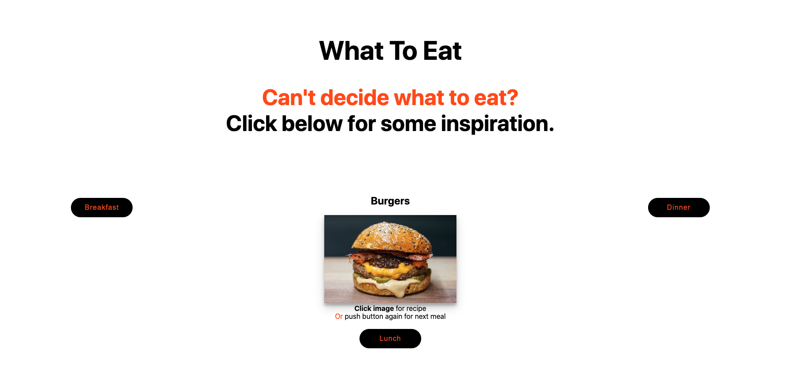

# what-to-eat
What To Eat is an application that helps users who can't decide what they want to cook or eat choose with the simple push of a button.

# Motivation
This app was built for those moments when no one can decide what to eat. This app allows users to click a button and have a random meal choice presented to them. If the user likes the chosen meal, they can click on the image and the recipe will be presented to them. If they don't want the meal, they can simply re-click the button for another random meal option.

## Home Page

### Lunch selected

### User clicks image for recipe

# Contributing
Contributions are welcome! If you notice a bug or have a feature in mind feel free to open an issue or pull request.
## Add a meal choice
If you have a meal option that you think should be added to the app, please feel free to open a pull request. Simply add the meal to the respective `json` file and an image in the `images` folder.
